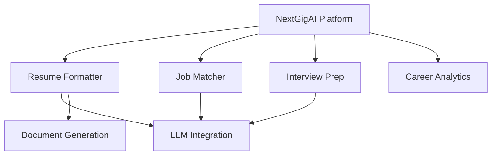

# 🚀 NextGigAI

[](https://opensource.org/licenses/MIT)
[](https://www.python.org/downloads/)
[](https://fastapi.tiangolo.com)
[](https://github.com/psf/black)

> 🎯 NextGigAI: Your AI-powered career acceleration platform

<div align="center">
  
</div>

## 🌟 Platform Overview

NextGigAI is a comprehensive AI-powered platform designed to accelerate your career journey. Each module is crafted to handle specific aspects of your professional development:

### Current Modules

#### 📑 Resume Formatter
Transform plain text resumes into professionally formatted documents using AI-powered section analysis.
- Intelligent section recognition
- Multiple professional templates
- DOCX and PDF output
- [Learn more about Resume Formatter](Modules/res_formatter/README.md)

### Coming Soon
- 🎯 Job Matcher
- 💼 Interview Prep
- 📊 Career Analytics
- 🤝 Network Builder

## 🏗️ Architecture

NextGigAI follows a modular architecture where each component is:
- **Self-contained**: Can be used independently
- **Integrated**: Works seamlessly with other modules
- **Standardized**: Follows consistent patterns
- **Testable**: Includes comprehensive tests



## 📦 Module Structure

Each module follows a consistent structure:
```
Modules/
├── res_formatter/           # Resume Formatter Module
│   ├── README.md           # Module-specific documentation
│   ├── requirements.txt    # Module dependencies
│   ├── tests/             # Module tests
│   ├── static/            # Module assets
│   └── templates/         # Module templates
├── job_matcher/           # Job Matcher Module (Coming Soon)
└── interview_prep/        # Interview Prep Module (Coming Soon)
```

## 🚀 Quick Start

1. **Clone the Repository**
```bash
git clone https://github.com/yourusername/NextGigAI.git
cd NextGigAI
```

2. **Choose a Module**
```bash
cd Modules/res_formatter
pip install -r requirements.txt
```

3. **Run the Module**
```bash
uvicorn resume-web:app --reload
```

## 🛠️ Development

### Module Development
1. Create a new module directory
2. Follow the standard module structure
3. Implement required interfaces
4. Add comprehensive tests
5. Document thoroughly

### Branch Strategy
- `main`: Stable releases
- `develop`: Integration branch
- `feature/module-name`: New modules
- `feature/module-name/feature`: Module features

## 🤝 Contributing

We welcome contributions! See our [Contributing Guide](CONTRIBUTING.md) for details.

### Module Contributions
1. Choose or propose a module
2. Follow module structure
3. Implement required interfaces
4. Add tests and documentation
5. Submit a pull request

## 📜 License

This project is licensed under the MIT License - see the [LICENSE](LICENSE) file for details.

## 🙏 Acknowledgments

- All our amazing contributors
- Open source community
- AI/ML framework providers

---

<div align="center">
  Made with ❤️ by the NextGigAI Team
</div>
